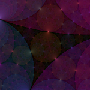
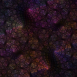
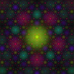

# Super-Apollonian Fractal

The Apollonian Gasket is a pretty well-known fractal that you get
by taking four mutually tangent circles and then adding the
circles tangent to any subset of three mutually tangent circles,
recursively and _ad infinitum_.
The union of these circles is also the limit set of a **Kleinian Group**,
a discrete group of M&#246;bius transformations.

In a way, the Apollonian Gasket is pretty similar to the simpler Sierpinski
Gasket, but it's also more beautiful in the sense that it has a very natural
group of exact symmetries, namely the Kleinian Group mentioned above.

However, one could be bothered by the fact that the "inside" and "outside"
of any one of those circles are not symmetric with respect to one another.
There's an obvious way to remedy that,
leading to what I'm calling the "Super-Apollonian" fractal here.
It's simply the closure of the Apollonian Gasket under its own symmetry group
and one judiciously chosen additional transformation that swaps the inside
and outside of one of the circles.

The image shown here is an attempt at a nice visualization of that concept.

[Source code](https://github.com/dranjan/super-apollonian-cpp)

# Twisted Pair Fractal

This is a visualization of a particular two-generator Kleinian group.
I'm working on a full description, but until that's done,
maybe you can reverse-engineer my work from the image!

# Pentagonal Wave Interference Fractal

This is a quasi-periodic fractal made from wave interference patterns.

# Site Favicon

[{:width="128px" :height="128"}](favicon.html)

This is a colormapped Hilbert curve, which is a well known space-filling fractal curve.
The image links to the main article.
